# I'm appleparan(or skyobserver)

👨‍💻 Jongsu Kim, Ph.D. | AI Research Engineer

Senior Research Engineer at LG CNS

🔍 Core Expertise: GenAI & LLM

* Agentic AI Inference
* Inference Optimization
* Data-Centric AI for training data

🛠️ Focus: AI Infrastructure & Ops

* GPU Orchestration: Enterprise Cluster Management & Slurm
* Observability: Victoria Metrics, Grafana, & Langfuse
* ML Workflows: Scalable CI/CD & Automated HPO Pipelines

🚀 Technical Interests

* Scalable Infra: Production-ready Agentic AI & LLMOps
* HPC: Parallel Processing & Computational Science

📬 Reach Me
* [liam.kim](https://liam.kim/)

## GitHub stats

